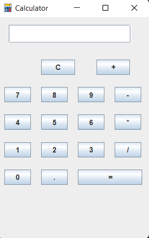

# Calculator Application

This is a **simple calculator** application built using **Java Swing** for the graphical user interface (GUI). It performs basic arithmetic operations such as addition, subtraction, multiplication, and division. The application has a user-friendly interface, making it easy to input numbers and perform calculations.

## Features

- **Basic Arithmetic Operations**: Addition, Subtraction, Multiplication, Division
- **Clear Button**: Reset the calculation and start a new one
- **Decimal Point Support**: Allows decimal inputs
- **Real-time Updates**: Displays the result instantly when equals (`=`) is pressed
- **Graphical User Interface**: Built using Java Swing

## Technologies Used

- **Java Swing**: For building the graphical interface
- **Java AWT**: For event handling and component layouts
- **JButton** and **JTextField**: For creating interactive buttons and display fields


  ## Screenshots

Here’s a sneak peek of the Calculator in action:


*calculator interface*


*calculator interface*


## How to Run the Application

1. **Clone the repository**:
   ```bash
   git clone https://github.com/Ritesh-Gawai/calculator-app.git
